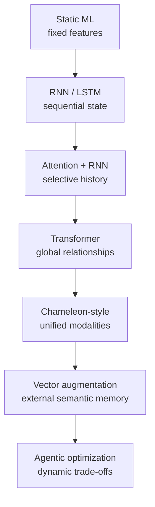
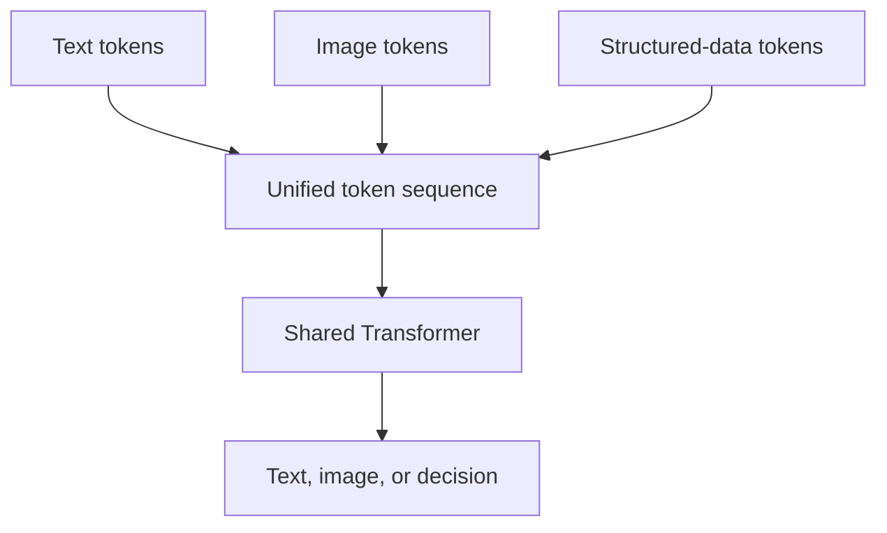
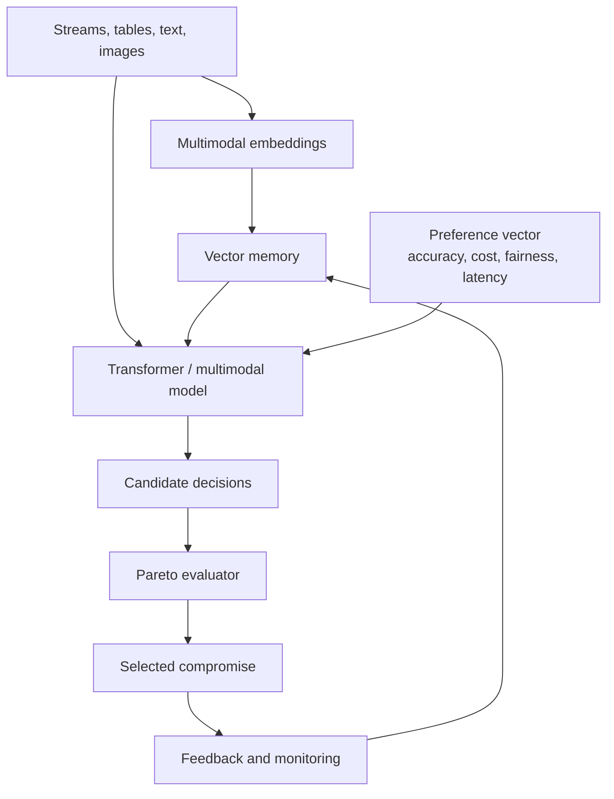
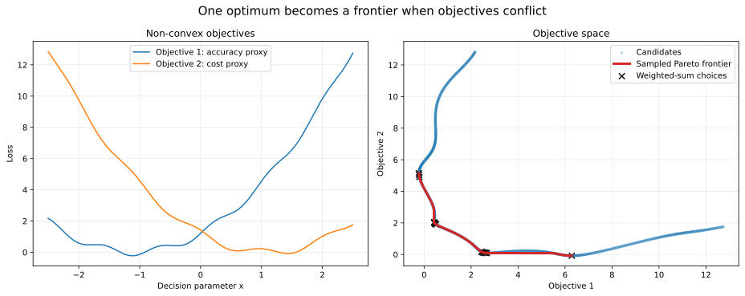
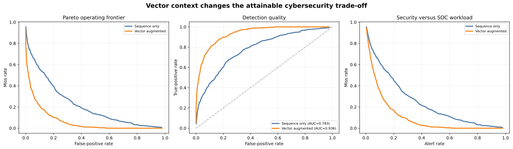
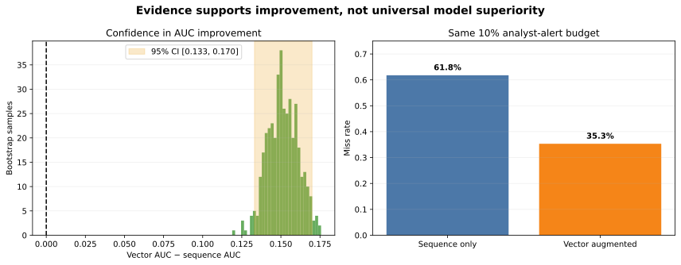
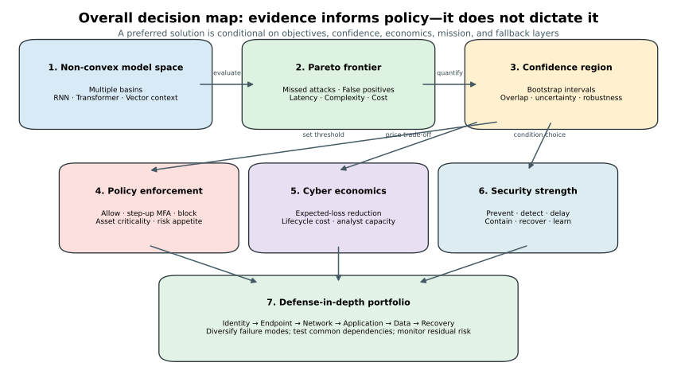

# Non-Convex & Multi-Objective Neural Optimization

> A practical, visual exploration of how sequential models, Transformers, multimodal early-fusion systems, and vector-augmented retrieval expand the state available to an optimizer.

[](https://www.python.org/)
[](LICENSE)
[](#learning-path)

## Why this repository exists

Real data-mining systems rarely optimize one clean, bowl-shaped function. A fraud model must detect more attacks while limiting false alarms, latency, cost, unfairness, and operational friction. Neural networks make the search expressive—but highly non-convex.

This repository connects the mathematics to the architecture evolution:



The central claim is deliberately precise: **newer architectures do not make the objective convex**. They improve the representation, conditioning, search policy, and evidence available while the training landscape generally remains non-convex.

## Research framing: neural cyber governance and the cost-efficient security frontier

This repository can also be interpreted as a computational framework for studying **neural-network-assisted cyber governance under economic and operational constraints**. The research question is not simply whether a neural architecture can improve classification accuracy. A more consequential question is whether richer learned representations can improve the *attainable set of cybersecurity governance decisions* when an organization must simultaneously manage residual risk, control cost, operational friction, compliance obligations, analyst capacity, and mission requirements.

Under this interpretation, cybersecurity governance is modeled as a multi-objective decision problem. Let an organizational cyber state be represented by a high-dimensional set of observations:

```text
X = {threat, vulnerability, asset, identity, control,
     cost, compliance, mission, operations}
```

A neural architecture learns a representation of this state and produces risk estimates or candidate decisions:

```text
X -> learned cyber-risk representation -> candidate controls or policies
```

Sequential models may encode temporal attack behavior; Transformers may capture long-range interactions among events and controls; multimodal models may integrate telemetry, text, diagrams, and structured evidence; and vector-augmented systems may retrieve current organizational or threat knowledge. These architectures therefore expand the information available to the decision process. They do not, however, eliminate the underlying conflict among governance objectives.

A cyber governance problem can be expressed as minimizing a vector of competing objectives:

```text
min_theta [ResidualRisk(theta),
           ControlCost(theta),
           OperationalFriction(theta),
           ComplianceGap(theta)]
```

while simultaneously seeking improvements in properties such as detection, prevention, resilience, containment, and recovery. In general, no single control configuration optimizes every dimension. The relevant mathematical object is therefore a **Pareto-efficient cyber frontier**: a set of security postures for which improvement in one objective requires deterioration in at least one other objective.

This creates a direct analogy to the efficient frontier in portfolio theory. In a financial portfolio, an efficient frontier describes non-dominated combinations of risk and expected return. In cybersecurity governance, the analogous frontier describes non-dominated combinations of **security assurance, residual risk, lifecycle cost, and operational burden**. The analogy is conceptual rather than identical: cyber risk is adversarial, partially observable, non-stationary, and difficult to price, so the objectives generally extend beyond a two-dimensional risk-return model.

The term **cost-driven cyber dimensionality** is used here to describe the fact that security investment propagates across several interacting dimensions rather than along a single cost axis. An additional control may increase direct expenditure while changing implementation complexity, SOC workload, user friction, attack-surface exposure, detection capability, expected loss, and regulatory assurance. Consequently, the mapping from security expenditure to security outcome is generally nonlinear and may be non-convex.

```text
Cyber investment
    -> control lifecycle cost
    -> implementation complexity
    -> SOC / analyst workload
    -> user and business friction
    -> attack-surface reduction
    -> detection and prevention capability
    -> expected-loss reduction
    -> regulatory and mission assurance
```

This distinction is important for interpreting the frontier. Movement toward a higher-assurance operating region does not necessarily produce direct cash savings. The economic value may instead appear as **incremental risk assurance**: a reduction in residual exposure or an improvement in decision confidence obtained for a given level of organizational resources. The shaded regions in the cybersecurity experiments in this repository should therefore be interpreted as changes in attainable risk assurance and decision quality, not as guaranteed financial returns.

The neural model and the Pareto optimizer also serve different functions from the governance layer. The neural model estimates or represents the cyber state. The multi-objective optimizer identifies efficient alternatives. **Governance determines which efficient alternative is acceptable.** A simplified preference-conditioned governance objective can be represented as:

```text
argmin_theta [w_r * ResidualRisk(theta)
            + w_c * ControlCost(theta)
            + w_o * OperationalBurden(theta)
            + w_f * BusinessFriction(theta)]
```

The weights are not intrinsic properties of the neural network. They represent organizational preferences determined by risk appetite, regulation, mission criticality, threat conditions, budget constraints, and available operational capacity. Two organizations using the same underlying risk model may therefore rationally select different points on the same Pareto frontier.

This motivates the interpretation of the **solution hyperplane** used in this repository. The hyperplane is not intended to establish a universally optimal security configuration. It represents a governance preference structure imposed on the attainable solution space. Changing policy priorities effectively changes the orientation of this preference surface and can move the selected operating point to a different region of the Pareto frontier.

The resulting conceptual architecture is:

```text
Cyber environment and telemetry
        |
        v
Neural / Transformer / multimodal representation
        |
        v
Learned high-dimensional cyber-risk state
        |
        v
Candidate controls, thresholds, or policies
        |
        v
Multi-objective optimization
        |
        v
Non-convex Pareto solution space
        |
        v
Cyber cost-efficient frontier
        |
        v
Governance preference model
(risk appetite + regulation + mission + budget)
        |
        v
Selected cybersecurity operating posture
        |
        v
Monitoring, feedback, and frontier re-estimation
```

The cybersecurity laboratory provides a controlled example of this mechanism. Sequence-only and vector-augmented risk models are not evaluated solely by predictive accuracy. They are evaluated by how they alter the attainable trade-off among missed attacks, false positives, complexity, and analyst workload. If additional contextual representation reduces missed attacks at a fixed alert budget, the principal governance result is not merely that one classifier has a higher AUC. The more significant result is that the **attainable cyber decision frontier has shifted**, potentially giving decision-makers a superior set of feasible operating choices under the same resource constraint.

This leads to the broader research hypothesis explored by the repository:

> **Neural architectures can improve cybersecurity governance by increasing the fidelity of high-dimensional risk representations and thereby shifting or clarifying the attainable Pareto frontier; multi-objective optimization can identify economically and operationally efficient security postures within that frontier; governance mechanisms must then select among those postures according to explicit organizational preferences and constraints.**

The framework therefore does not assume that artificial intelligence can determine how much cybersecurity is objectively “enough.” Instead, it separates three research problems: **representation**, in which neural systems estimate a complex and changing cyber state; **optimization**, in which Pareto methods characterize non-dominated security trade-offs; and **governance**, in which accountable decision-makers determine which trade-off is acceptable. A natural extension of this work is an N-dimensional cyber governance frontier incorporating residual risk, lifecycle cost, control effectiveness, regulatory compliance, operational friction, SOC workload, resilience, and epistemic uncertainty, with the frontier continuously re-estimated as threat and organizational conditions change.

## Core formulation

For parameters `theta` and `m` competing losses:

```text
min_theta F(theta) = [L1(theta), L2(theta), ..., Lm(theta)]
```

A solution is Pareto-efficient when no objective can improve without worsening at least one other objective. The result is typically a **Pareto frontier**, not a single universal optimum.

Common strategies include:

- weighted scalarization: `L = sum(w_i * L_i)`;
- epsilon constraints: optimize one loss while bounding the others;
- gradient balancing or projection when task gradients conflict;
- Pareto-set learning conditioned on a preference vector;
- evolutionary or Bayesian search for expensive black-box objectives.

## Architectural evolution

| Generation | Representation | Optimization advantage | Persistent limitation |
|---|---|---|---|
| Classical ML | Static engineered features | Smaller, easier search spaces | Weak sequence and unstructured-data modeling |
| RNN / LSTM | Recurrent hidden state | Temporal credit assignment and state-conditioned decisions | Sequential bottleneck and fading long-range memory |
| Transformer | Global attention over tokens | Direct feature interactions and scalable preference conditioning | Expensive, high-dimensional non-convex training |
| Chameleon-style model | Unified text/image token stream | Cross-modal objectives in one representation space | Modality competition, alignment, and compute cost |
| Vector-augmented system | Model context plus retrieved embeddings | Current, domain-specific evidence without full retraining | Retrieval adds relevance/latency/cost/security objectives |
| Agentic system | Models, tools, memory, feedback | Iterative experiment selection and frontier navigation | Stability, control, evaluation, and governance |

## How each stage helps

### 1. RNNs: optimization with compressed temporal memory

An RNN updates a state:

```text
h_t = phi(W_x x_t + W_h h_(t-1) + b)
```

It enables sequence-aware mining—fraud histories, intrusion traces, churn trajectories, and equipment telemetry. A preference-conditioned policy can generate different decisions for different priorities:

```text
pi_theta(action_t | h_t, preference_weights)
```

The RNN does not solve non-convexity; it learns a state and a search/decision heuristic through backpropagation through time.

### 2. Transformers: optimization with globally related context

Self-attention lets every token directly weight every other token:

```text
Attention(Q, K, V) = softmax(Q K^T / sqrt(d_k)) V
```

This supports long-range relationships, parallel training, cross-feature interactions, and preference tokens that request different points on a Pareto frontier.

### 3. Chameleon-style systems: optimization across modalities

Here, “Chameleon-style” means early-fusion multimodal modeling inspired by Meta's Chameleon family—not a general synonym for every multimodal model.



This makes it possible to relate telemetry, technician notes, images, and diagrams inside a shared representation. Multi-objective training is still supplied by scalarization, constraints, gradient methods, or Pareto learning.

### 4. Vector augmentation: optimization with external memory

“Vector overlay augmentation” is treated here as vector-augmented retrieval/RAG, since the former is not a standardized architecture name.

```text
z_query = Encoder(query)
evidence = top_k(similarity(z_query, vector_store))
output = Model(query, evidence, preferences)
```

Retrieval improves grounding and supplies current organizational knowledge, but creates its own frontier across relevance, recall, latency, token cost, redundancy, and security.

## End-to-end architecture



## Runnable exploration

The included experiment creates a deliberately non-convex two-objective landscape, samples candidate parameters, identifies the non-dominated set, and compares it with solutions found using weighted scalarization.

```bash
python -m venv .venv
source .venv/bin/activate  # Windows: .venv\Scripts\activate
pip install -r requirements.txt
python experiments/pareto_landscape.py
```

Output is written to `artifacts/pareto_landscape.svg`.



### Cybersecurity industry lab

Open [`notebooks/cybersecurity_pareto_lab.ipynb`](notebooks/cybersecurity_pareto_lab.ipynb) for a self-contained SOC authentication-risk exercise. It generates privacy-safe synthetic telemetry and compares:

- sequence-only risk scoring, analogous to recurrent temporal state;
- vector-augmented scoring with device, travel, and attack-pattern context;
- Pareto-efficient thresholds across missed attacks, false positives, and complexity;
- preference-driven policy selection for a high-security SOC versus a resource-constrained SOC.

Run it locally with:

```bash
jupyter lab notebooks/cybersecurity_pareto_lab.ipynb
```

With the fixed seed and 5,000 synthetic authentication sessions, the lab finds:

| Validation measure | Sequence only | Vector augmented |
|---|---:|---:|
| ROC AUC | 0.783 | **0.936** |
| Miss rate at a fixed 10% alert budget | 61.8% | **35.3%** |

The bootstrapped AUC improvement is **+0.152** with a 95% confidence interval of **[+0.133, +0.170]**. Because the interval excludes zero and the miss rate falls at the same analyst workload, the controlled experiment supports the hypothesis that relevant vector context improves the attainable detection trade-off. These results demonstrate the mechanism on synthetic data; they are not a production-performance claim.



Business interpretation of the shaded area between the top curves:

| Chart | What the area means |
|---|---|
| Pareto operating frontier | Fewer missed attacks at the same enforcement friction. The value is incremental risk assurance, not guaranteed cash savings. |
| Detection quality | Additional detection confidence for the same false-alarm cost. It represents better decision quality under uncertainty. |
| Security versus SOC workload | Residual risk avoided at the same analyst investment. The improvement may justify spending even when it does not reduce the security budget. |



### Non-convexity, hyperplanes, and confidence


This visualization prevents an important overclaim:

- the **non-convex landscape** permits several locally attractive parameter regions;
- a **solution hyperplane** represents stakeholder preferences, not objective truth;
- changing the weight placed on missed attacks versus false positives changes which solution minimizes weighted loss;
- confidence intervals can overlap, so evidence may support a trade-off region without proving one architecture universally superior;
- the appropriate conclusion is conditional: *given these objectives, preferences, data, and uncertainty, this operating point is supported*.

Regenerate the figure with:

```bash
python experiments/confidence_tradeoff_hyperplane.py
```

### Policy, economics, and defense in depth



The model frontier becomes an organizational decision only after policy and investment priorities are applied. See [`docs/03-policy-economics-defense-in-depth.md`](docs/03-policy-economics-defense-in-depth.md) for the full treatment of:

- permissive, risk-adaptive, and strict enforcement policies;
- expected-loss reduction versus total control lifecycle cost;
- why security strength includes prevention, detection, containment, recovery, and learning;
- marginal returns, correlated control failures, and defense-in-depth diversification;
- how mission, regulation, analyst capacity, and threat conditions move the preferred hyperplane.

### What to observe

1. The parameter landscape contains oscillations and multiple local basins.
2. No single point minimizes both objectives.
3. Non-dominated sampling reveals a trade-off frontier.
4. Weighted sums recover useful compromises, but can miss sections of a non-convex frontier.

## Learning path

1. Read [`docs/01-foundations.md`](docs/01-foundations.md) for convexity, dominance, and gradient conflict.
2. Read [`docs/02-model-evolution.md`](docs/02-model-evolution.md) for the RNN-to-agentic-system narrative.
3. Run [`experiments/pareto_landscape.py`](experiments/pareto_landscape.py).
4. Change the objective functions or preference weights and compare the frontier.

## Repository map

```text
.
├── README.md
├── docs/
│   ├── 01-foundations.md
│   ├── 02-model-evolution.md
│   └── 03-policy-economics-defense-in-depth.md
├── experiments/
│   ├── confidence_tradeoff_hyperplane.py
│   └── pareto_landscape.py
├── notebooks/
│   └── cybersecurity_pareto_lab.ipynb
├── tests/
│   └── test_pareto.py
├── requirements.txt
├── LICENSE
└── CITATION.cff
```

## Responsible interpretation

- Attention weights are not automatically causal explanations.
- Retrieval quality depends on embedding choice, chunking, filters, and corpus quality.
- A visually attractive Pareto frontier does not establish fairness or safety.
- Preference weights encode policy choices and should be governed explicitly.
- Multimodal fusion can propagate bias or noise between modalities.

## References

- Vaswani et al., [Attention Is All You Need](https://arxiv.org/abs/1706.03762), 2017.
- Peitz & Hotegni, [Multi-objective Deep Learning: Taxonomy and Survey](https://arxiv.org/abs/2412.01566), 2024.
- Meta FAIR, [Chameleon: early-fusion token-based mixed-modal models](https://ai.meta.com/blog/meta-fair-research-new-releases/), 2024.
- Karl et al., [Multi-Objective Hyperparameter Optimization in Machine Learning](https://arxiv.org/abs/2206.07438), 2022/2024.

## License

MIT. See [`LICENSE`](LICENSE).