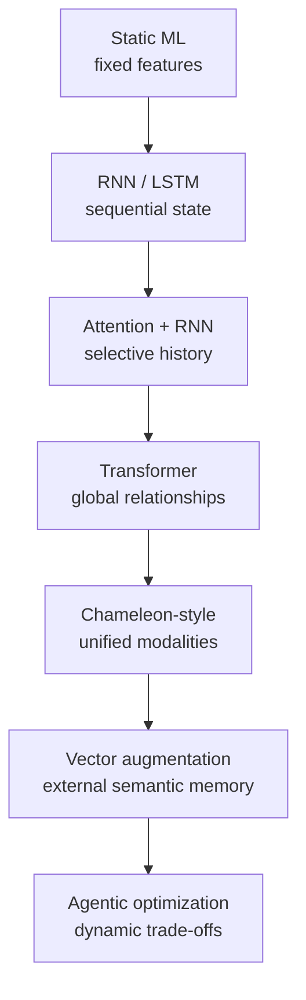
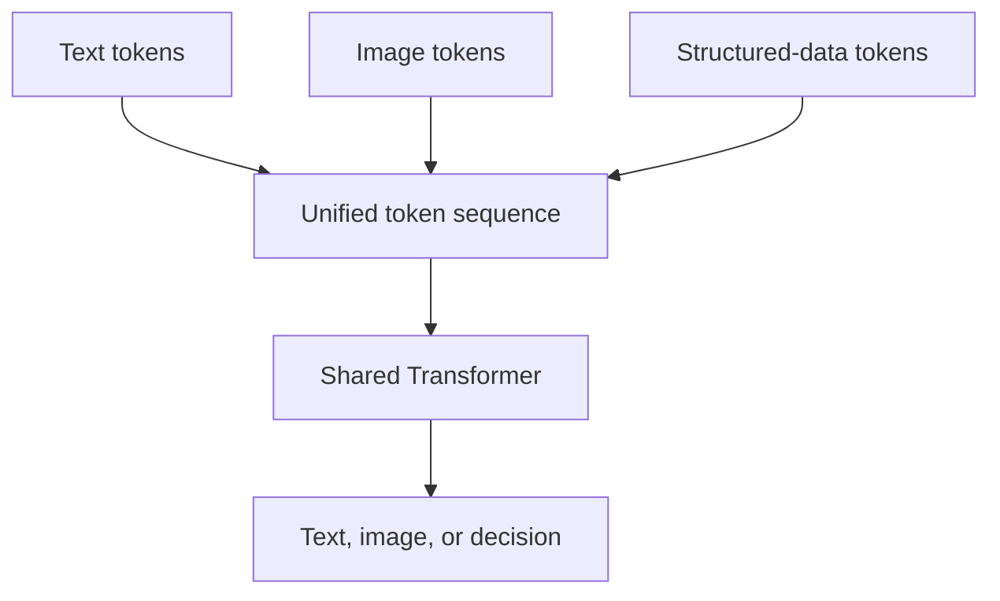
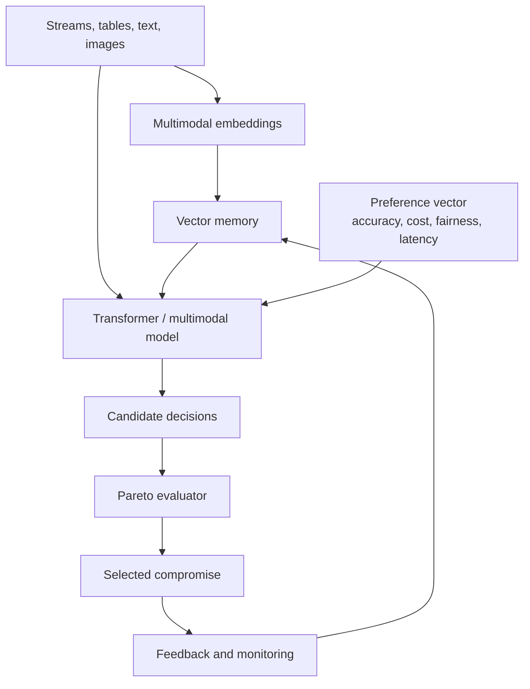

# Non-Convex & Multi-Objective Neural Optimization

> A practical, visual exploration of how sequential models, Transformers, multimodal early-fusion systems, and vector-augmented retrieval expand the state available to an optimizer.

[](https://www.python.org/)
[](LICENSE)
[](#learning-path)

## Why this repository exists

Real data-mining systems rarely optimize one clean, bowl-shaped function. A fraud model must detect more attacks while limiting false alarms, latency, cost, unfairness, and operational friction. Neural networks make the search expressive—but highly non-convex.

This repository connects the mathematics to the architecture evolution:



The central claim is deliberately precise: **newer architectures do not make the objective convex**. They improve the representation, conditioning, search policy, and evidence available while the training landscape generally remains non-convex.

## Core formulation

For parameters `theta` and `m` competing losses:

```text
min_theta F(theta) = [L1(theta), L2(theta), ..., Lm(theta)]
```

A solution is Pareto-efficient when no objective can improve without worsening at least one other objective. The result is typically a **Pareto frontier**, not a single universal optimum.

Common strategies include:

- weighted scalarization: `L = sum(w_i * L_i)`;
- epsilon constraints: optimize one loss while bounding the others;
- gradient balancing or projection when task gradients conflict;
- Pareto-set learning conditioned on a preference vector;
- evolutionary or Bayesian search for expensive black-box objectives.

## Architectural evolution

| Generation | Representation | Optimization advantage | Persistent limitation |
|---|---|---|---|
| Classical ML | Static engineered features | Smaller, easier search spaces | Weak sequence and unstructured-data modeling |
| RNN / LSTM | Recurrent hidden state | Temporal credit assignment and state-conditioned decisions | Sequential bottleneck and fading long-range memory |
| Transformer | Global attention over tokens | Direct feature interactions and scalable preference conditioning | Expensive, high-dimensional non-convex training |
| Chameleon-style model | Unified text/image token stream | Cross-modal objectives in one representation space | Modality competition, alignment, and compute cost |
| Vector-augmented system | Model context plus retrieved embeddings | Current, domain-specific evidence without full retraining | Retrieval adds relevance/latency/cost/security objectives |
| Agentic system | Models, tools, memory, feedback | Iterative experiment selection and frontier navigation | Stability, control, evaluation, and governance |

## How each stage helps

### 1. RNNs: optimization with compressed temporal memory

An RNN updates a state:

```text
h_t = phi(W_x x_t + W_h h_(t-1) + b)
```

It enables sequence-aware mining—fraud histories, intrusion traces, churn trajectories, and equipment telemetry. A preference-conditioned policy can generate different decisions for different priorities:

```text
pi_theta(action_t | h_t, preference_weights)
```

The RNN does not solve non-convexity; it learns a state and a search/decision heuristic through backpropagation through time.

### 2. Transformers: optimization with globally related context

Self-attention lets every token directly weight every other token:

```text
Attention(Q, K, V) = softmax(Q K^T / sqrt(d_k)) V
```

This supports long-range relationships, parallel training, cross-feature interactions, and preference tokens that request different points on a Pareto frontier.

### 3. Chameleon-style systems: optimization across modalities

Here, “Chameleon-style” means early-fusion multimodal modeling inspired by Meta's Chameleon family—not a general synonym for every multimodal model.



This makes it possible to relate telemetry, technician notes, images, and diagrams inside a shared representation. Multi-objective training is still supplied by scalarization, constraints, gradient methods, or Pareto learning.

### 4. Vector augmentation: optimization with external memory

“Vector overlay augmentation” is treated here as vector-augmented retrieval/RAG, since the former is not a standardized architecture name.

```text
z_query = Encoder(query)
evidence = top_k(similarity(z_query, vector_store))
output = Model(query, evidence, preferences)
```

Retrieval improves grounding and supplies current organizational knowledge, but creates its own frontier across relevance, recall, latency, token cost, redundancy, and security.

## End-to-end architecture



## Runnable exploration

The included experiment creates a deliberately non-convex two-objective landscape, samples candidate parameters, identifies the non-dominated set, and compares it with solutions found using weighted scalarization.

```bash
python -m venv .venv
source .venv/bin/activate  # Windows: .venv\Scripts\activate
pip install -r requirements.txt
python experiments/pareto_landscape.py
```

Output is written to `artifacts/pareto_landscape.png`.

### Cybersecurity industry lab

Open [`notebooks/cybersecurity_pareto_lab.ipynb`](notebooks/cybersecurity_pareto_lab.ipynb) for a self-contained SOC authentication-risk exercise. It generates privacy-safe synthetic telemetry and compares:

- sequence-only risk scoring, analogous to recurrent temporal state;
- vector-augmented scoring with device, travel, and attack-pattern context;
- Pareto-efficient thresholds across missed attacks, false positives, and complexity;
- preference-driven policy selection for a high-security SOC versus a resource-constrained SOC.

Run it locally with:

```bash
jupyter lab notebooks/cybersecurity_pareto_lab.ipynb
```

With the fixed seed and 5,000 synthetic authentication sessions, the lab finds:

| Validation measure | Sequence only | Vector augmented |
|---|---:|---:|
| ROC AUC | 0.783 | **0.936** |
| Miss rate at a fixed 10% alert budget | 61.8% | **35.3%** |

The bootstrapped AUC improvement is **+0.152** with a 95% confidence interval of **[+0.133, +0.170]**. Because the interval excludes zero and the miss rate falls at the same analyst workload, the controlled experiment supports the hypothesis that relevant vector context improves the attainable detection trade-off. These results demonstrate the mechanism on synthetic data; they are not a production-performance claim.

### Non-convexity, hyperplanes, and confidence


This visualization prevents an important overclaim:

- the **non-convex landscape** permits several locally attractive parameter regions;
- a **solution hyperplane** represents stakeholder preferences, not objective truth;
- changing the weight placed on missed attacks versus false positives changes which solution minimizes weighted loss;
- confidence intervals can overlap, so evidence may support a trade-off region without proving one architecture universally superior;
- the appropriate conclusion is conditional: *given these objectives, preferences, data, and uncertainty, this operating point is supported*.

Regenerate the figure with:

```bash
python experiments/confidence_tradeoff_hyperplane.py
```

### What to observe

1. The parameter landscape contains oscillations and multiple local basins.
2. No single point minimizes both objectives.
3. Non-dominated sampling reveals a trade-off frontier.
4. Weighted sums recover useful compromises, but can miss sections of a non-convex frontier.

## Learning path

1. Read [`docs/01-foundations.md`](docs/01-foundations.md) for convexity, dominance, and gradient conflict.
2. Read [`docs/02-model-evolution.md`](docs/02-model-evolution.md) for the RNN-to-agentic-system narrative.
3. Run [`experiments/pareto_landscape.py`](experiments/pareto_landscape.py).
4. Change the objective functions or preference weights and compare the frontier.

## Repository map

```text
.
├── README.md
├── docs/
│   ├── 01-foundations.md
│   └── 02-model-evolution.md
├── experiments/
│   ├── confidence_tradeoff_hyperplane.py
│   └── pareto_landscape.py
├── notebooks/
│   └── cybersecurity_pareto_lab.ipynb
├── tests/
│   └── test_pareto.py
├── requirements.txt
├── LICENSE
└── CITATION.cff
```

## Responsible interpretation

- Attention weights are not automatically causal explanations.
- Retrieval quality depends on embedding choice, chunking, filters, and corpus quality.
- A visually attractive Pareto frontier does not establish fairness or safety.
- Preference weights encode policy choices and should be governed explicitly.
- Multimodal fusion can propagate bias or noise between modalities.

## References

- Vaswani et al., [Attention Is All You Need](https://arxiv.org/abs/1706.03762), 2017.
- Peitz & Hotegni, [Multi-objective Deep Learning: Taxonomy and Survey](https://arxiv.org/abs/2412.01566), 2024.
- Meta FAIR, [Chameleon: early-fusion token-based mixed-modal models](https://ai.meta.com/blog/meta-fair-research-new-releases/), 2024.
- Karl et al., [Multi-Objective Hyperparameter Optimization in Machine Learning](https://arxiv.org/abs/2206.07438), 2022/2024.

## License

MIT. See [`LICENSE`](LICENSE).
