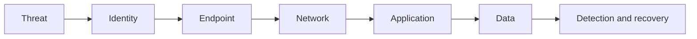

# From Model Trade-offs to Cybersecurity Policy and Investment

## The hyperplane is a governance choice

A Pareto frontier shows which combinations of outcomes are attainable. It does not decide which outcome an organization should prefer. That decision is expressed through policy, risk appetite, legal obligations, mission priorities, and budget constraints.

For a cybersecurity program, a simplified objective can be written as:

```text
minimize F(x) = [residual risk, enforcement friction, expected loss, control cost, response time]
```

A weighted decision rule might be:

```text
J(x) = w_risk * residual_risk
     + w_friction * business_friction
     + w_loss * expected_loss
     + w_cost * control_cost
     + w_time * response_time
```

The weights define a preference hyperplane. They are not discovered from model accuracy alone. Executives, system owners, security teams, legal counsel, regulators, and mission operators implicitly or explicitly choose them.

## 1. Policy enforcement trade-offs

Security policy determines how a risk score becomes an action. The same detector can support very different enforcement postures.

| Detection result | Permissive policy | Risk-adaptive policy | Strict policy |
|---|---|---|---|
| Low risk | Allow | Allow | Allow and log |
| Moderate risk | Log or alert | Step-up MFA | Block or require approval |
| High risk | Analyst review | Isolate or block | Block, isolate, and investigate |
| Uncertain evidence | Usually allow | Request more evidence | Default deny |

A lower blocking threshold usually reduces missed attacks but increases false positives, user interruption, help-desk load, and the chance that personnel bypass controls. A higher threshold improves availability and convenience but accepts more residual risk.

This means the trade-off changes according to the system:

- A public information site may prioritize availability and tolerate more suspicious traffic.
- A financial transaction system may require step-up authentication before transferring funds.
- A privileged administrative console may use default-deny enforcement because compromise impact is extreme.
- A safety-critical or defense system may prefer graceful degradation and isolation over an abrupt shutdown that could jeopardize the mission.

Enforcement should therefore be conditional on asset criticality, identity privilege, data sensitivity, threat intelligence, and confidence—not driven by one global threshold.

## 2. Economics of cybersecurity

Cybersecurity investment is economically rational when its marginal reduction in expected loss justifies its marginal cost, subject to mandatory obligations and unacceptable catastrophic risks.

```text
Annualized expected loss = event probability * loss magnitude

Risk reduction value = expected loss before controls - expected loss after controls

Net security value = risk reduction value - control lifecycle cost
```

Control lifecycle cost includes more than purchase price:

- licensing and infrastructure;
- integration and engineering;
- tuning and monitoring;
- analyst investigation time;
- employee productivity loss;
- training and change management;
- incident recovery and technical debt;
- audit evidence and compliance maintenance.

An apparently stronger model may be economically inferior if it produces so many false positives that analyst costs, alert fatigue, and operational disruption exceed the incremental reduction in loss. Conversely, an expensive control may remain justified when it reduces low-frequency but existential loss, protects human safety, or satisfies a non-negotiable legal requirement.

The economic optimum is therefore not always the cheapest point. It is the point where additional spending no longer produces sufficient marginal risk reduction—or where risk has reached the organization's tolerance boundary.

## 3. Security strength is multidimensional

Security strength should not be reduced to model accuracy. A stronger system can mean:

- greater attack prevention;
- earlier detection;
- smaller blast radius;
- higher attacker cost;
- faster containment and recovery;
- stronger evidence integrity;
- lower privilege and exposure;
- resilience when one control fails.

A detector with excellent AUC but weak integration into identity, endpoint, network, and response controls may provide less practical protection than a slightly weaker detector embedded in a mature response architecture.

Security strength can be represented as a vector:

```text
S = [prevent, detect, delay, contain, recover, learn]
```

Organizations select different points depending on their threat model. A mature program seeks balanced strength instead of maximizing a single component.

## 4. Defense-in-depth investment

Defense in depth places partially independent controls across the attack path:



Each layer can prevent, detect, delay, contain, or help recover from failure at another layer. Investment decisions should consider both marginal protection and control dependence.

| Investment | Primary benefit | Typical trade-off | Failure it compensates for |
|---|---|---|---|
| Phishing-resistant MFA | Prevent account takeover | User and integration friction | Password compromise |
| Endpoint detection | Detect and contain execution | Agent cost and tuning | Preventive-control bypass |
| Segmentation | Reduce lateral movement | Architectural complexity | Compromised endpoint |
| WAF/API protection | Filter application attacks | False blocks and latency | Exposed application flaws |
| Encryption/key management | Limit data disclosure | Key lifecycle cost | Storage or transport compromise |
| Immutable backups | Improve recovery | Storage and recovery testing | Ransomware or destructive attack |
| SIEM/SOAR | Correlate and respond | Data and analyst expense | Fragmented control visibility |

### Diversification versus duplication

Two controls are not automatically twice as strong. If they depend on the same identity provider, telemetry pipeline, cloud region, administrator, or detection logic, their failures may be correlated.

A simplified combined-failure estimate for independent controls is:

```text
P(all layers fail) = P(layer 1 fails) * P(layer 2 fails) * ...
```

Real controls are rarely fully independent. Common-mode failure raises the combined risk. Good defense-in-depth investment therefore emphasizes:

- different control mechanisms;
- separation of duties;
- independent logging and recovery paths;
- architectural segmentation;
- tested manual fallbacks;
- diversity of detection evidence.

## 5. How the preferred point changes

| Decision context | Hyperplane shifts toward | Reason |
|---|---|---|
| Active targeted attack | Lower missed-attack rate | Immediate threat outweighs friction |
| Severe analyst shortage | Lower false-positive and alert rate | Unreviewed alerts provide little protection |
| Safety-critical operation | Availability, containment, graceful degradation | Blocking may create physical or mission harm |
| High-value regulated data | Strong prevention, evidence, and accountability | Breach consequences and obligations are high |
| Low-margin consumer service | Automation and proportional controls | Excess friction and cost threaten viability |
| Privileged administrator access | Strict verification and default deny | Small volume, extreme compromise impact |
| Disaster recovery period | Resilience and restoration speed | Normal preventive posture may impede recovery |

The preferred solution can move even when the underlying models do not change. New threat intelligence, a regulatory deadline, depleted analyst capacity, a merger, or a major incident can change the weights and constraints.

## 6. Practical investment method

1. **Define mission outcomes.** Identify what must continue operating and what losses are unacceptable.
2. **Model threat and exposure.** Estimate plausible attack paths, likelihood ranges, and consequences.
3. **Establish constraints.** Treat legal, safety, privacy, and minimum-control obligations separately from negotiable preferences.
4. **Measure the frontier.** Compare residual risk, cost, friction, response time, and resilience across candidate portfolios.
5. **Test dependencies.** Identify common-mode failures and single points of control failure.
6. **Choose transparently.** Document weights, assumptions, confidence intervals, risk acceptance, and decision authority.
7. **Monitor movement.** Recalculate when threats, assets, control effectiveness, or organizational capacity change.

## Executive interpretation

The Pareto frontier answers:

> What trade-offs are technically and economically attainable?

The preference hyperplane answers:

> Given our mission and risk appetite, which attainable compromise do we currently prefer?

Confidence analysis answers:

> How strongly does the evidence support that choice, and how likely is the choice to change under uncertainty?

Defense in depth answers:

> If the selected model or control fails, what independent layers still prevent a catastrophic outcome?

No single model, threshold, or control portfolio is universally best. A defensible cybersecurity decision is one whose objectives, constraints, uncertainties, dependencies, and accepted residual risks are explicit.

